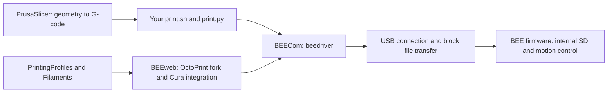

# BEEVERYCREATIVE source investigation

This report describes the baseline before the Python 3 workflow fixes. The old issues listed below are historical findings; see [current README](../README.md) and [fix record](../CRITICAL_FIXES.md) for their resolution. The original `src/beedriver/` and historical `API.md` are now preserved in `backups/legacy-python2-20261001.tar.gz`, outside the active source tree.

Investigated 2026-10-01 against public upstream snapshots recorded in [upstream/manifest.json](upstream/manifest.json). The SDK's commands, firmware handlers, and actual CLI code were compared. No printer was connected, reset, heated, moved, or flashed. Your existing changes to `src/calibrate.py` and untracked `gcode/` were left alone.

## How your project fits together

Your project already wraps the manufacturer's SDK. Every bundled `src/beedriver/*.py` file was compared with BEECom. `commands.py` is byte-for-byte identical to the inspected upstream version; `connection.py` contains your USB string-descriptor handling and connection-error fixes. The other module comparisons are recorded in `upstream/driver-comparison.json`. The driver exposes substantially more than the CLI menu: pause/resume/cancel, print metadata, filename reporting, electronics and extruder-block temperatures, nozzle size, filament tracking, extruder steps, and configuration management.

The bundled driver does not establish the exact version installed historically from pip. Upstream's inspected `setup.py` identifies the package as `beecom`, version `0.3.35`; the import package is `beedriver`. BEEweb imports `beedriver.connection.Conn` and delegates print jobs to `BeeCmd.printFile`. These files support your recollection that BEECom was the dependency.

## Repositories worth using

| Repository | What it gives us | Practical use |
| --- | --- | --- |
| [BEEcom](https://github.com/beeverycreative/BEEcom) | USB SDK, command API, console, block-transfer implementation | Base for reliable printing and a future Python 3 port |
| [beethefirst-firmware](https://github.com/beeverycreative/beethefirst-firmware) | Actual G/M handlers, parsing, heater and board variants | Resolve command meanings rather than assuming Marlin semantics |
| [BEETHEFIRST-Integration](https://github.com/beeverycreative/BEETHEFIRST-Integration) | Integration PDFs and workflow diagrams for transfers, printing and calibration | Specification for independent host software |
| [PrintingProfiles](https://github.com/beeverycreative/PrintingProfiles) | JSON printer/material/nozzle/quality inheritance | Printer-specific starting parameters and material support |
| [Filaments](https://github.com/beeverycreative/Filaments) | Older BEESOFT XML presets, including PETg; conversion tool `tools/bee2cura.py` | Compare historical settings and understand material-profile evolution |
| [FilamentProfileCalibration](https://github.com/beeverycreative/FilamentProfileCalibration) | Cube assets and a script generating varied flow-rate copies | Basis for a modern flow-calibration workflow; review its old script before running |
| [BEEweb](https://github.com/beeverycreative/BEEweb) | OctoPrint fork with BEE host logic and Cura/CuraX plugins | Reference for preparing jobs, monitoring and profile inheritance |
| [BEEwebPi](https://github.com/beeverycreative/BEEwebPi) | Raspberry Pi packaging | Historical deployment reference |
| [beethefirst-software](https://github.com/beeverycreative/beethefirst-software) | Original desktop software | Older application workflow reference |
| [beethefirst-bootloader](https://github.com/beeverycreative/beethefirst-bootloader) | Bootloader source | Understand modes and USB enumeration; not needed for normal slicing |

`Marlin-BEEVERYCREATIVE` describes itself as the **helloBEEprusa** firmware fork. `B2X300-*` also targets another machine. Neither is the correct command reference for the stock BEETHEFIRST+ merely because the manufacturer owns it.

## Command meanings confirmed in firmware

The main reference is [gcode_process.c](https://github.com/beeverycreative/beethefirst-firmware/blob/5e7b3cc/beethefirst/gcode_process.c); a local snapshot is in `upstream/beethefirst-firmware/`. Build-time conditionals matter: handler presence alone does not prove the installed board/firmware configuration.

| Command | Meaning in this source | Why it matters |
| --- | --- | --- |
| `M21` | Initialize SD | Used during transfer/selection |
| `M23 filename` | Open an existing SD file | Your CLI uses lowercase as a historical workaround |
| `M30 filename` | Create/truncate the SD destination | Different from common Marlin conventions; defaults to `ABCDE` |
| `M28 A… D…` | Begin transferring a byte range | SDK sends file data in blocks, not just serial lines |
| `M31 A… L…` | Set estimated minutes and total executable commands | Generate it for each job; do not copy another job's values |
| `M32` | Query estimate, elapsed time, and progress counters | `B` is milliseconds; `C/D` represent bytes if no line count was supplied, otherwise commands |
| `M33 [filename]` | Start autonomous SD printing | Optional filename; defaults to `ABCDE`. There is no `M24` handler in this source |
| `M625` | Report status | Emits uppercase `S:`; SDK normalizes case |
| `M206 X500` | Set acceleration to 500 mm/s² | **Not a home offset**. My earlier profile label was incorrect |
| `M130 T6 U1.3 V80` | Set heater PID coefficients and write configuration | **Not tool selection or extrusion tuning**. `U` is divided by 1000 internally |
| `M642 W1.066` | Set firmware extrusion coefficient to 1.066 | Multiplies extrusion during SD printing; can compound slicer flow changes |
| `M703 S…` | Start heating workflow with homing/positioning | More than a temperature wait; suitable for SDK's load/unload workflow |
| `M701` / `M702` | Firmware filament load/unload sequences | Existing CLI already uses these |
| `M1033 name` | Host-provided displayed filename | SDK-generated print header includes this |
| `M112` | Stop/clear print state, with a call to `home()` | Do not treat it as a guaranteed motion-free emergency stop |

`M104` clamps at 250 C normally and 300 C under `EXP_Board`. `pinout.h` enables `EXP_Board` for `BTF_PLUS` and related builds. This is a software limit, **not** a certified sustained hotend temperature rating. `M109` calls `temp_set` directly in the inspected handler; do not assume its limit behavior is identical to `M104`.

The inspected dispatcher has no explicit `G21`, `M82`, or `M83` handlers. PrusaSlicer emits `G21/M82` in normal absolute-extrusion output. Existing saved prints contain them too, so missing dispatch alone is not evidence that the whole print will fail; it is a reason to check the actual firmware responses. `G90/G91` control this firmware's global relative/absolute coordinate mode. Keep absolute extrusion for the current setup. Do not introduce relative extrusion based on a generic Marlin profile.

## Official PETG support

`PrintingProfiles/BTF_Series/Quality/PETG - RED.json` and `PETG - TRANSPARENT.json` explicitly list `beethefirstplus`, `beethefirstplusa`, `beeinschool`, and `beeinschoola`. Their medium quality uses 0.2 mm layers and 230 C. The red profile supplies flow 104.8%; its inherited PETG material sets outer walls to 20 mm/s and cooling to 75%. The shared machine profile has an unheated, center-origin 190 x 135 x 125 mm envelope.

That establishes manufacturer-provided PETG profiles for the “+” machine. It does **not** establish that historical BEE filament temperatures, flow or cooling match your current Polymaker spool. Keep the Polymaker profile at its researched starting values rather than copying the old BEE correction factors. The experimental label describes unverified Polymaker performance on your unheated plate, not an absence of original PETG support.

## Concrete issues in your current CLI

These are source-review findings; they have not been exercised against a live printer.

1. **Temperature selection:** `src/print.py` scans every `M104/M109` and retains the last target above 150 C. A print starting at 215 C and continuing at 210 C is preheated to 210 C. A temperature-tower file is preheated to its last stage. Choose an explicit user target or the first intended extrusion temperature; account for temporary startup targets. The new offline inspector reports the first positive target without silently defaulting to 200 C.
2. **Heating timeout:** after the 300-second loop expires, execution still proceeds to print. It needs an explicit successful-heating outcome before starting.
3. **Transfer outcome:** stopping a transfer thread is not proof of a successful transfer. Check the create/transfer result, cancellation, timeout and byte completion before proceeding. The upstream thread can return early after failed file creation.
4. **Status case and evidence:** `src/print.py` and `src/monitor.py` search raw replies for lowercase `s:5`, while firmware emits uppercase `S:`. Separately, any `A/B/D` fields from `M32` do not prove printing: those variables can exist while idle. Use normalized status parsing with bounded waits.
5. **Response handling:** the `M23` check calls `response.lower()` even if `sendCmd` returned `None`; missing responses need a defined failure path.
6. **Monitoring connection:** `Conn.connect()` calls `dev.set_configuration()` and `dev.reset()`, including when invoked from `monitor.py`. Query commands are read-only, but opening the connection is not demonstrably passive. Determine USB reset effects and implement an attach mode before advertising noninterfering monitoring during a print. A USB bus reset is not automatically equivalent to a firmware reboot; hardware behavior needs verification.
7. **Progress labels:** monitor labels all `M32 C/D` values as lines; firmware falls back to byte counters without `M31`. Show byte progress or inject freshly calculated metadata. Don't treat every nonprinting state as idle.
8. **PETG handling:** load/unload scripts hardcode 215 C. Add material/temperature arguments based on the spool and machine before using those scripts as a PETG workflow.
9. **Resource cleanup:** some entrypoints do not close the connection on exit/error. Add `finally` cleanup as part of a workflow refactor.
10. **Documentation drift:** `CRITICAL_FIXES.md` mentions `cardreader.cpp` and a lowercasing implementation that is not in the inspected stock C firmware. `M33` accepts a filename, contrary to its “NO filename” claim. Keep the working lowercase convention until tested, but label it as an observed workaround rather than attributing it to that unrelated code.

Replacing the custom print path with `BeeCmd.printFile()` is worth evaluating, but is not a drop-in proof of correctness: that SDK path heats to `printTemperature + 5`, uses asynchronous work, and has its own transfer/error behavior. Preserve current working behavior until a bounded, tested replacement is ready.

## Added in this investigation

`./print.sh inspect /path/to/file.gcode` runs the new Python 3 standard-library inspector before legacy environment setup. It returns JSON containing command counts, nozzle targets, heated-bed commands, BEE-specific command effects, and commands absent from the inspected firmware dispatcher. It does not load `beedriver` or access USB. It is a source-comparison tool, not a compatibility certificate.

The newly installed PrusaSlicer printer profile's copied `M130` PID write was removed from normal startup after its actual effect was established. The original recovered profile is retained as a backup. Acceleration 500 and other recovered motion settings remain; no printer configuration was written.

Recommended subsequent work: fix bounded print/transfer handling first; add material-aware load/unload and trustworthy status/metadata next; then port the driver to Python 3 with mocked USB transport tests and hardware tests. Python 3 migration needs explicit bytes/text handling for the 64-byte USB messages and block transfers, not just syntax conversion.

## Source preservation

Only selected reference files and a provenance manifest are copied into `docs/upstream/`; full downloaded archives are in `/tmp`. Reference files retain upstream content and licensing. The manifest is used at runtime for the firmware command list; the source snapshots support the protocol investigation. BEEweb's communication module was separately inspected from `src/octoprint/util/bee_comm.py` on `master`. The rest of BEEweb was inventoried, not fully audited.
